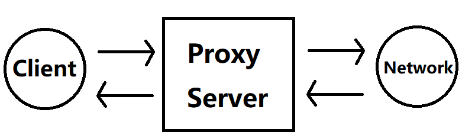

# Assignment 2: Simple Web Proxy

----
私たちのCS
Contact: Sixu Tan, sixu.tan@foxmail.com

----
Dear Sherry,

Welcome to our second assignment. In this assignment, you will be able to practice the http and html knowledge we covered in the last lecture. Note that considering your excellent performance in Assignment1, I decide to award you a **Level UP**! This means that the assignment2 will be more challenging and more programming skills are needed. But no worries, all tools will be introduced in the example code and our introduction **Mini Lecture**. Go for it!

Best Regards,
Sixu

## Introduction
A web proxy is an agent between the client and the server. As shown in the figure, it has the following functions:
1. Receive web request from the client.
2. Send the request to server.
3. Receive response from server.
4. Send the response to the client.
  

In real world, a proxy often serves for privacy, secerity, and cache. However, in this assignment, you only need to implement a simple web proxy that has the very basic proxy function.

Complete your code in file *Assignment2/webproxy.py*.

## Recap
1. What is HTTP used for?
2. The components of HTTP?
3. HTTP Methods?
4. The components of URL?

## Task1: Read example code
I will walk you though in our mini lecture.
Mini lecture: **TBD**

## Task2: Proxy
1. Parse the requested URL from POST method
2. Use urllib.request to request for the URL
3. Receive the response, reply to the client
4. Extra: Modify the web/index.html, add a nice picture of us into it. Also add a table that shows our future TODO.
