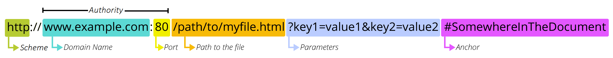

# Introduction to Web - URL and HTTP

## Recap
1. What is a socket?
2. TCP and UDP?
3. Which one HTTP runs on?
4. What is DNS?

## URL
### URL and URI
Uniform Resource Locator (URL)

Uniform Resource Identifier (URI)

Subset

## URL Component

  

## Example

https://www.bilibili.com/video/BV1KN411C7Kj/?spm_id_from=333.1007.tianma.1-2-2.click&vd_source=e070d0d75a1efd44a30610c96b96e8bc

Q
1. locolhost自己用socket通信的情况

# HTTP
hyper text transfer protocol

TCP

TLS
SSL

MAC

CA

# HTTPS
secured

